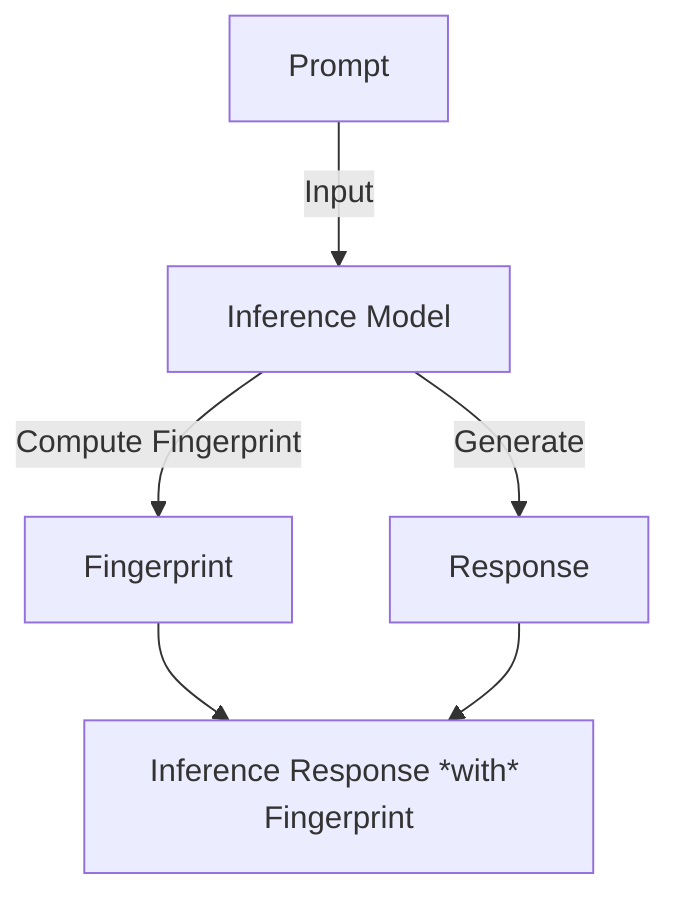
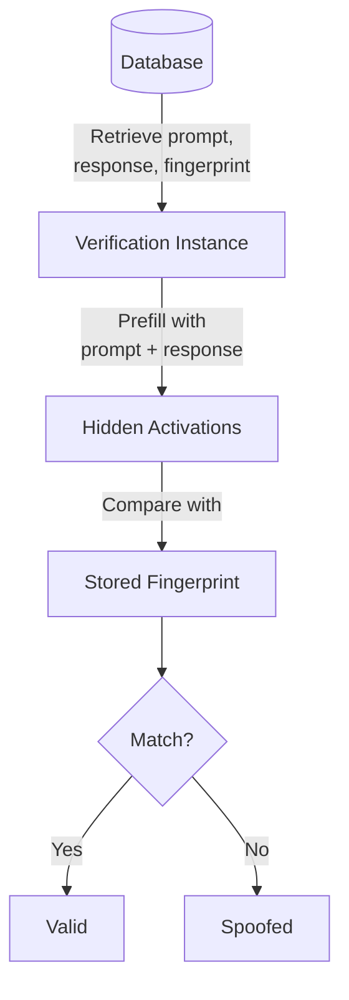
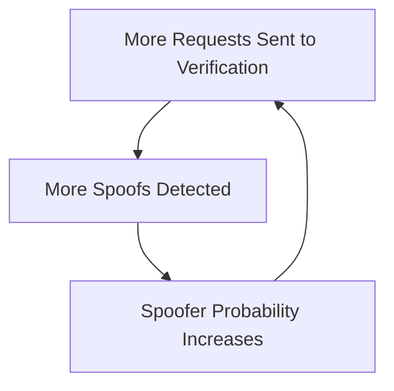
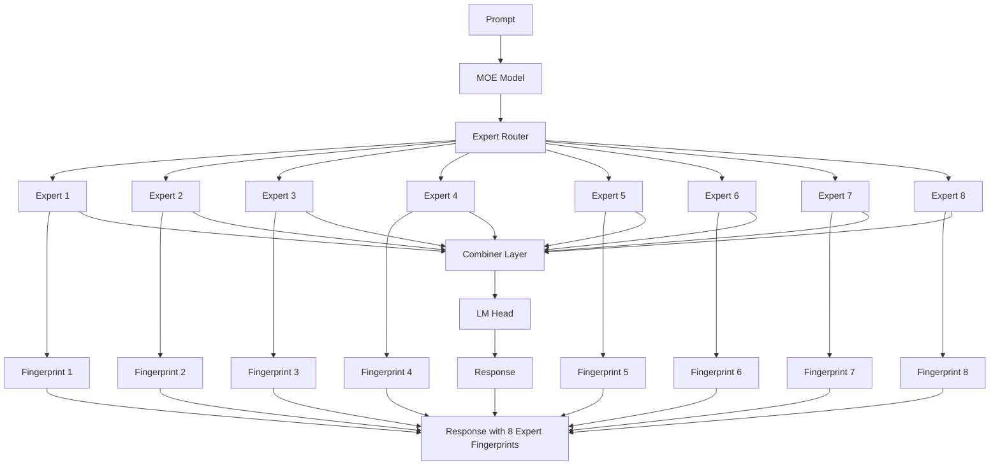
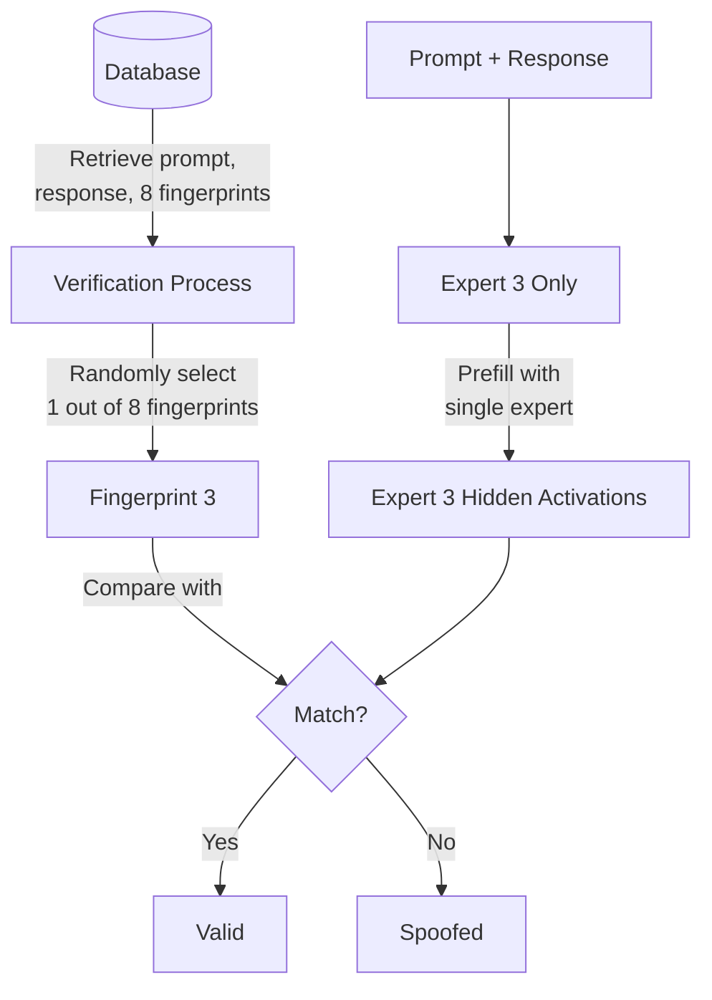

# Verification

**Goal**: Automatically detect and flag "spoofed inferences".

**Business Value**: Prevents fraud and ensures the quality of the service.
This becomes even more important if we want to embrace a fully decentralized model for inference.

**Constraints**: Low error rate, minimal speed impact.

We are trying to answer one simple question: **"Did you use the model you say you did to generate this response?"**

This weeds out a variety of kinds of spoofing, like:
- Running a different quantization
- Running a different model

## My Mindset

"In the lab" and "in production" are two different things.  So for me, it's less about TopLOC specifically, and more about getting something out there with instrumentation.

However, I feel that TopLOC represents a great starting point.  TopLOC is the only practical approach I've seen that addresses the problem of validating internal model states.  It works well in my testing.  And I understand it well enough that if it breaks down in some way, we can probably fix it or adjust it, or try something similar.

So, my main goal is to fail fast and then iterate - rather than advocate for a specific paper, algorithm, etc.  The sooner we can get an MVP system up and running, and the easier we can pivot, the happier I am.

Also, I think that SGLang was probably the hardest of the engines to fork.  I'm guessing that VLLM and ollama will be easier.

## Technical Approach - Overview

This is a fork of SGLang.

It extends SGLang by adding two new capabilities:
- The ability to include a "top loc fingerprint" with every inference response
- The ability to validate that a fingerprint matches a model's internal state

Here is how those capabilities are used to make verification work:

1. An instance running this fork of SGLang will compute a "top loc fingerprint" of the internal activations of the model and include it with the inference response.
2. When we want to verify a response, we will send the prompt, the response, and the fingerprint to a verification instance running the same model as the operator claims they used.
3. The verification instance will run a prefill with the prompt + response.  This replicates the state of the model as of when the last token was generated with the original inference.
4. The verification instance compares the internal states of the model with the fingerprint it was asked to validate.
5. The verification instance includes how closely the fingerprint matched the internal state of the model in its response.


### Also...
I'll cover a reputation update system that only slashes operators when it's "reasonably sure" they're a spoofer (taking into account the False Negative Rate).

### Fingerprinting


### Example Fingerprint:
This string encodes the value of the Top 128 largest activations of the last hidden layer of the inference model.
```json
"/9nWITn6firYaHRIbYCxYbsuqR/m2RmF7Qsh3Gh1jLATqnNWEQWknWvSHSNXwtxTUQ7tZ4P/GnR1EqsChhMhKm78WNaLsCUBl6ksyhLqPMpYui9zSjfNcafVtYFd836AjagNOVbgiZqj/zQRCXPUhK+orxjTHrhATDqspkJ+LzCzk9JtrK58GD6G5l+HvG73pZlvHNcwDmhkPp5ao8qGToYqxwx/OC88U5ezA3WdrrVha2ZJFA2wlbQqOpE8FY0Po2DrhCHXhnZirWGBuNckB4tpdSnrjdZIi1Pq6iAB7o41i8GUDY99+nk4he8Ceo9afZ4bJL3z9ci/DeeQrsJg07GH"
```
This is what it looks like in the response (called *toploc_verification_fingerprints*):
```json
{
    "choices": [{
        "message": {
            "content": "Cross-training can benefit ...",
            "toploc_verification_fingerprints": [
                "/9nWITn6firYaHRIbYCxYbsuqR/m2RmF7Qsh3Gh1jLATqnNWEQWknWvSHSNXwtxTUQ7tZ4P/GnR1EqsChhMhKm78WNaLsCUBl6ksyhLqPMpYui9zSjfNcafVtYFd836AjagNOVbgiZqj/zQRCXPUhK+orxjTHrhATDqspkJ+LzCzk9JtrK58GD6G5l+HvG73pZlvHNcwDmhkPp5ao8qGToYqxwx/OC88U5ezA3WdrrVha2ZJFA2wlbQqOpE8FY0Po2DrhCHXhnZirWGBuNckB4tpdSnrjdZIi1Pq6iAB7o41i8GUDY99+nk4he8Ceo9afZ4bJL3z9ci/DeeQrsJg07GH"
            ],
        }
    }]
}
```

The fingerprint (aka "verification fingerprint") is generated by encoding the value of the Top 128 largest activations of the last hidden layer of the inference model:


### Verifying The Fingerprint

Presumably we have stored the fingerprint, prompt, and response in PG.

If we want to want to verify a response, we would construct an inference request that looks like this:

```python
client.chat.completions.create(
    model="meta-llama/Llama-3.1-8B-Instruct", # <-- same model
    messages=[
        {"role": "user", "content": original_prompt},
        {"role": "assistant", "content": response }, # <--- note this
    ],
    max_tokens=0, # <--- note this
    extra_body={
        "toploc_verification_fingerprint_to_validate": last_token_fingerprint,
    },
)
```
Because we set `max_tokens=0`, the model will perform a "prefill-only", which is MUCH faster than the step-by-step decode used to generate the original response.

Internally, it will compare the `toploc_verification_fingerprint_to_validate` with its own activations of the last hidden layer of the model after the prefill.



### Reliability
The system should have a near-zero (if not zero) False Negative Rate and a low False Positive Rate.

### Reputation

**Please Note**: *After experimenting with implementating the operator reputation described in this section, the "update formula" ended up being more complicated than I anticipated.  Even if you do it mathematically correctly, it has weird edge cases.  I've pivoted away from the Bayesian approach and went with a much simpler hypothesis testing approach, and so far that's been working out better.*

We will introduce a "Spoofer Probability" that assigns each operator a 1% chance of being a "spoofer".

| Operator ID | Spoofer Probability |
|-------------|---------------------|
| operator_1  | 1%                  |
| operator_2  | 1%                  |
| operator_3  | 1%                  |
| operator_4  | 1%                  |


When a inference request is marked as a spoof, we update the spoofer probability according to this formula:

$$\text{New Spoofer Probability} = \frac{P(\text{Spoofer})}{P(\text{Spoofer}) + r \cdot (1 - P(\text{Spoofer}))}$$

Where $r$ is the False Positive Rate of the verification system (we will have different rates per model). Assuming a False Positive Rate of 1%:


| Operator ID | Number of Spoofed Inferences | Updated Spoofer Probability |
|-------------|------------------------------|------------------------------|
| operator_1  | 0 (Initial)                  | 1%                           |
| operator_1  | 1                            | 50.25%                       |
| operator_1  | 2                            | 99.02%                       |
| operator_1  | 3                            | 99.99%                       |

This makes sense because the more times a response is marked as a spoof, the more likely it is that the operator is a spoofer.

This update formula is a form of Bayes' Theorem, which is a fair way of updating probabilities based on new evidence.

### Optimization 1: Stochastic Verification

To cut down on the number of verifications needed, we can use a stochastic verification approach.

Instead of verifying all requests, we randomly select a subset of the requests to verify.

We pick requests to verify based on this simple rule: Pick a random number between 0 and 1.  If the number is less than the spoofer probability, verify the request.

Therefore:
1. If the spoofer probability of an operator is 100%, 100% of their requests go to verification.
2. If the spoofer probability of an operator is 50%, 50% of their requests go to verification.
3. If the spoofer probability of an operator is 1%, 1% of their requests go to verification.




This creates a feedback cycle that quickly identifies and pushes spoofers out of the system.

When the Spoofer Probability exceeds some threshold (e.g. 99.99%), we can block the operator and/or apply punitive measures like slashing.

### Optimization 2: MOE Fingerprinting

While prefilling is much faster than step-by-step decoding, the hardware required to run prefilling is just as expensive as the hardware required to run step-by-stfep decoding.

Models like DeepSeek-V3 use a MOE architecture (Mixture of Experts).  At runtime, the model will select 8 out of 128 experts based on a "expert router".

The intermediate results of the experts are combined in a final layer before being sent to the final LM-head.



Instead of fingerprinting the final hidden activations of the model, we can fingerprint the last hidden activations of the 8 selected experts.

Then, for verification, we can randomly select one of the 8 experts and run a prefill with just that expert.



This reduces the memory required for prefilling from x8 A100s to x1.

### Phased Rollout

For each model:
1. Experimentally measure the False Positive Rate and False Negative Rate, store it in metadata.
2. Flip the "perform verification" flag on
3. Monitor the spoofer probabilities / results
4. Turn on the "punitive" aspects of verification for that model

### Potential Griefing Vector

Theoretically, a spoofer could:
1. Come up with whatever inference response they want: `prompt = "What are the benefits of cross-training?"`, `response = "blah blah blah"`
2. Run a prefill on their fake response and collect the genuine fingerprint of the fake response: `fingerprint("What are the benefits of cross-training?" + "blah blah blah")`
3. Return this fingerprint and their fake response, and not generate any new tokens.

I'm aware that this is a griefing vector.  It's a weakness present with the original TopLOC paper, that I'm not sure even the authors of the original paper considered it.

I've been thinking about this and how this might be patched up.  Nothing has occurred to me yet, but I think there may be some kind of solution involving cryptographic committments (something including an extra sha256 hash that proves that sampling actually occurred - i'm not quite sure yet).

We can do some basic things to not make it easy.  And the attacker would basically need to understand the TopLOC paper to even think of doing this.

I'm not super worried because it's a clever workaround and wouldn't be discovered immediately, but I also wouldn't publicize our approach until we've had a chance to patch this up.
