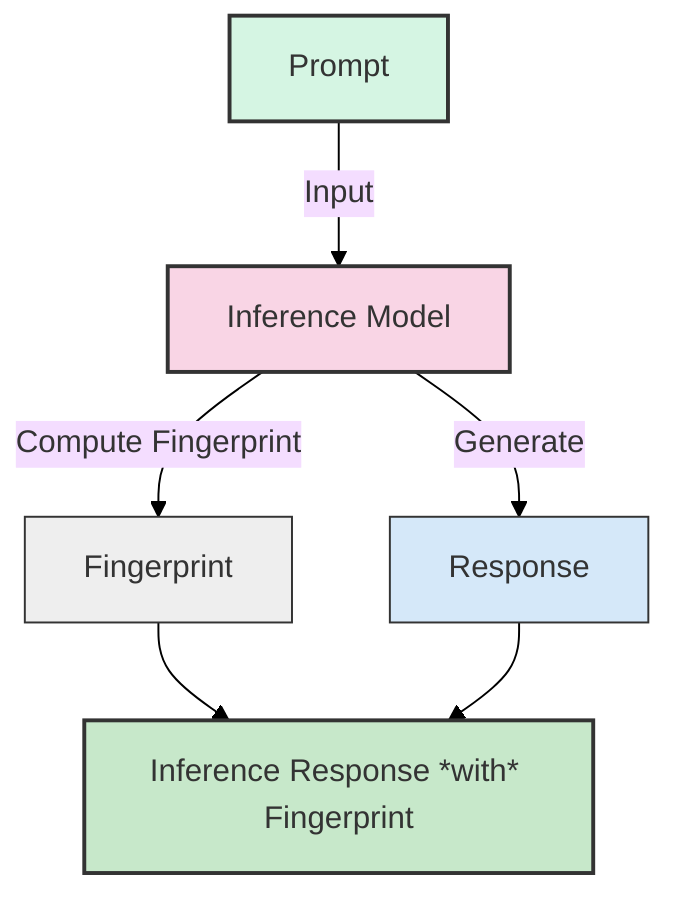
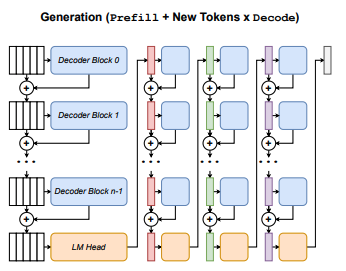
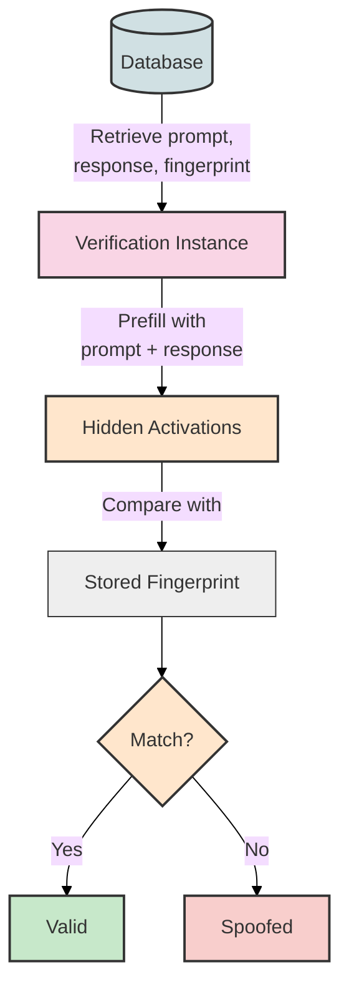
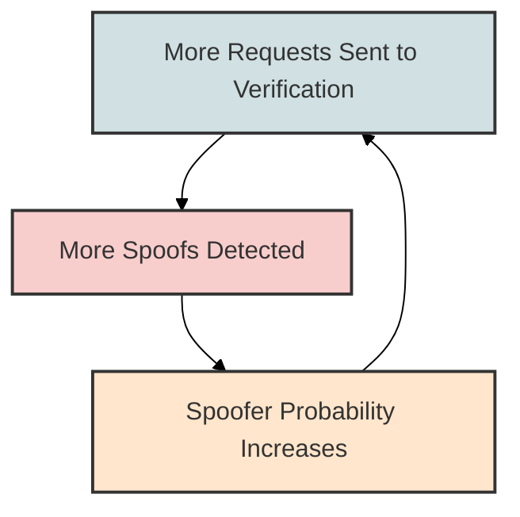
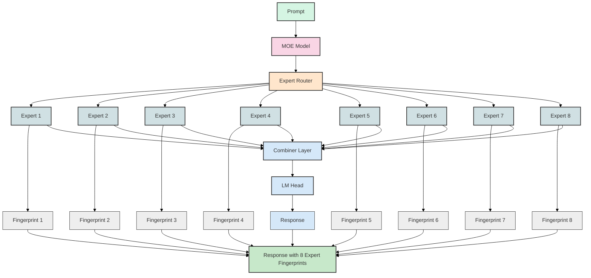
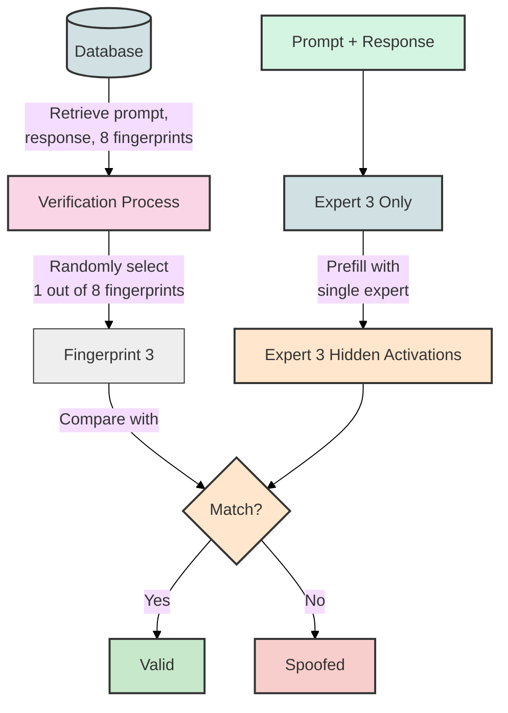

# Verification

**Goal**: Automatically detect and flag "spoofed inferences".

**Business Value**: Prevents fraud and ensures the quality of the service.

**Constraints**: Low error rate, minimal speed impact.


**Sam**: Since you want to get your hands dirty, here's a quick guide on how to work do the verification flow "by hand".

First, you need to checkout this branch from our fork of sglang, and create a virtual environment at the root of the repository.

Activate the environment and install sglang:

```
pip install -e "python[all]" --find-links https://flashinfer.ai/whl/cu124/torch2.5/flashinfer-python
pip install transformers==4.48.3
pip install datasets
```

You also need to set your `HF_TOKEN` environment variable to a token which has access to `meta-llama/3.1-8b-instruct`.  You can find mine in 1Password under Engineering.

```
export HF_TOKEN=...
```

For starters, try running this script:

```
python toploc-scripts/minimal_example.py --disable-cuda-graph
```

**Note**: CUDA graph introduces some kind of non-determinism in the prefill that makes verification occassionally fail (maybe 1 out of 6 times).  This is a new behavior compared to my testing from last week, so I'm hoping it's because I upgraded toploc to v0.1.4, and this is easily resolved.  I'll come back to this shortly.

If you really want to do the flow by hand, here's a step by step guide:

Here is the command you can run to start the server:
```
python -m sglang.launch_server --model-path meta-llama/Llama-3.1-8B-Instruct --host 0.0.0.0 --port 3001 --toploc-verification --toploc-verification-topk 128 --log-level debug --disable-cuda-graph
```

Now, you can send an inference request to the server, and you can see the fingerprint in the response:
```
import json
import openai

params = {
    "temperature": 0,
    "seed": 42,
}

client = openai.Client(base_url=f"http://127.0.0.1:3001/v1", api_key="None")

prompt = "What is the capital of Bulgaria?"
response = client.chat.completions.create(
    model="meta-llama/Llama-3.1-8B-Instruct",
    messages=[
        {"role": "user", "content": prompt},
    ],
    **params
)
response_dump = response.model_dump()
print("Response received:")
print(json.dumps(response_dump, indent=4))
```

The response will contain a `toploc_verification_fingerprints` array:
```json
{
    "choices": [
        {
            "message": {
                "content": "Sofia",
                "toploc_verification_fingerprints": ["...", "..."]
            }
        }
    ]
}
```

There are typically two.  We're only interested in the last one.

Now, we need to validate the fingerprint.  How do we do that?  By sending it to a verification instance along with the original prompt and response.

Step by step:

1. Append to the messages array, so that it includes both the original message and the response:
```json
{
    "role": "user",
    "content": "What is the capital of Bulgaria?"
},
// This is the response ---v to this ----^
{
    "role": "assistant",
    "content": (the response)
}
```

2. Set `max_tokens` to 0. This is what makes it a prefill.

3. Set `toploc_verification_fingerprint_to_validate` to the last fingerprint in the `toploc_verification_fingerprints` array.

The verification instance will respond with a `toploc_verification_fingerprint_validation_result`, which will look something like this (but serialized as a string):

```json
{
    "exp_mismatches": 1,
    "mant_err_mean": 0.75,
    "mant_err_median": 0.75,
}
```

These error statistics are what is interpreted to determine if this is a verification pass or verification failure.

If it seems like there's too many steps, please keep in mind that we *have* to:
1. Send a request
2. Collect the response's fingerprint
3. *Exactly* replicate the original prompt + response with a prefill request
4. Collect the validation result

The implementation of this fork would have been much simpler if we had worked with the SGLang module directly in Python (i.e.; `import sglang`), but that's not how our workers work.  Our workers runby running in a sidecar with an HTTP interface.  So that's why I engineered pass-thrus into the API layer.

**Important Note On Prefill Replication**

I am replicating the original prompt + response by appending an assistant message to the messages array to represent the response.

This will work in most cases, possibly all cases.

However, I'm anticipating that you can't completely replicate the prompt + response prefill if you have tools in your request, because tools aren't contained in the messages array.  It might be possible to get it to work, but I anticipate it to be buggy and error-prone.

Another concern is fragility.  Suppose that SGLang changes the way it parses or generates responses, the model  updates its chat template, etc etc.  Then, the same messages array will not correspond to the same token ID inputs.

For both of these reasons, I've implemented two other features to make pre-fill more robust:
1. `return_input_ids` - returns the token IDs of the prompt if included in the request
2. `return_output_ids` - returns the token IDs of the response if included in the request

Then, pre-fill request will simply take:
`input_ids[:-1] + output_ids + EOT`, which is a far more reliable way to replicate prompt + response.


**Approach**:

1. During inference, compute a "fingerprint" of the internal activations of the model.
2. Include the fingerprint in the inference response.
3. Later, the system sends the prompt, response, and fingerprint to a "verification instance".
4. The verification instance concatenates the prompt and response, and "prefills" the model with this text.
5. If the fingerprint matches the activations of the verification model (within tolerances), the response is valid.

**Answers one simple question**: **"Did you use the model you say you did to generate this response?"**

### Also...
I'll cover a reputation update system that only slashes operators when it's "reasonably sure" they're a spoofer (taking into account the False Negative Rate).

### Fingerprinting


### Example Fingerprint:
This string encodes the value of the Top 128 largest activations of the last hidden layer of the inference model.
```json
"/9nWITn6firYaHRIbYCxYbsuqR/m2RmF7Qsh3Gh1jLATqnNWEQWknWvSHSNXwtxTUQ7tZ4P/GnR1EqsChhMhKm78WNaLsCUBl6ksyhLqPMpYui9zSjfNcafVtYFd836AjagNOVbgiZqj/zQRCXPUhK+orxjTHrhATDqspkJ+LzCzk9JtrK58GD6G5l+HvG73pZlvHNcwDmhkPp5ao8qGToYqxwx/OC88U5ezA3WdrrVha2ZJFA2wlbQqOpE8FY0Po2DrhCHXhnZirWGBuNckB4tpdSnrjdZIi1Pq6iAB7o41i8GUDY99+nk4he8Ceo9afZ4bJL3z9ci/DeeQrsJg07GH"
```
This is what it looks like in the response (called *toploc_verification_fingerprints*):
```json
{
    "choices": [{
        "message": {
            "content": "Cross-training can benefit ...",
            "toploc_verification_fingerprints": [
                "/9nWITn6firYaHRIbYCxYbsuqR/m2RmF7Qsh3Gh1jLATqnNWEQWknWvSHSNXwtxTUQ7tZ4P/GnR1EqsChhMhKm78WNaLsCUBl6ksyhLqPMpYui9zSjfNcafVtYFd836AjagNOVbgiZqj/zQRCXPUhK+orxjTHrhATDqspkJ+LzCzk9JtrK58GD6G5l+HvG73pZlvHNcwDmhkPp5ao8qGToYqxwx/OC88U5ezA3WdrrVha2ZJFA2wlbQqOpE8FY0Po2DrhCHXhnZirWGBuNckB4tpdSnrjdZIi1Pq6iAB7o41i8GUDY99+nk4he8Ceo9afZ4bJL3z9ci/DeeQrsJg07GH"
            ],
        }
    }]
}
```

The fingerprint (aka "verification fingerprint") is generated by encoding the value of the Top 128 largest activations of the last hidden layer of the inference model:



### Verifying The Fingerprint

Presumably we have stored the fingerprint, prompt, and response in PG.

If we want to want to verify a response, we would construct an inference request that looks like this:

```python
client.chat.completions.create(
    model="meta-llama/Llama-3.1-8B-Instruct", # <-- same model
    messages=[
        {"role": "user", "content": original_prompt},
        {"role": "assistant", "content": response }, # <--- note this
    ],
    max_tokens=0, # <--- note this
    extra_body={
        "toploc_verification_fingerprint_to_validate": last_token_fingerprint,
    },
)
```
Because we set `max_tokens=0`, the model will perform a "prefill-only", which is MUCH faster than the step-by-step decode used to generate the original response.

Internally, it will compare the `toploc_verification_fingerprint_to_validate` with its own activations of the last hidden layer of the model after the prefill.



### Reliability
The system should have a near-zero (if not zero) False Negative Rate and a low False Positive Rate.

### Reputation
We will introduce a "Spoofer Probability" that assigns each operator a 1% chance of being a "spoofer".

| Operator ID | Spoofer Probability |
|-------------|---------------------|
| operator_1  | 1%                  |
| operator_2  | 1%                  |
| operator_3  | 1%                  |
| operator_4  | 1%                  |


When a inference request is marked as a spoof, we update the spoofer probability according to this formula:

$$\text{New Spoofer Probability} = \frac{P(\text{Spoofer})}{P(\text{Spoofer}) + r \cdot (1 - P(\text{Spoofer}))}$$

Where $r$ is the False Positive Rate of the verification system (we will have different rates per model). Assuming a False Positive Rate of 1%:


| Operator ID | Number of Spoofed Inferences | Updated Spoofer Probability |
|-------------|------------------------------|------------------------------|
| operator_1  | 0 (Initial)                  | 1%                           |
| operator_1  | 1                            | 50.25%                       |
| operator_1  | 2                            | 99.02%                       |
| operator_1  | 3                            | 99.99%                       |

This makes sense because the more times a response is marked as a spoof, the more likely it is that the operator is a spoofer.

This update formula is a form of Bayes' Theorem, which is a fair way of updating probabilities based on new evidence.

**TODO**: *note to self - the update rule isn't exactly correct*

### Optimization 1: Stochastic Verification

To cut down on the number of verifications needed, we can use a stochastic verification approach.

Instead of verifying all requests, we randomly select a subset of the requests to verify.

We pick requests to verify based on this simple rule: Pick a random number between 0 and 1.  If the number is less than the spoofer probability, verify the request.

Therefore:
1. If the spoofer probability of an operator is 100%, 100% of their requests go to verification.
2. If the spoofer probability of an operator is 50%, 50% of their requests go to verification.
3. If the spoofer probability of an operator is 1%, 1% of their requests go to verification.

This creates a feedback loop that quickly removes spoofers from the system.



When the Spoofer Probability exceeds some threshold (e.g. 99.99%), we can block the operator and/or apply punitive measures like slashing.

### Optimization 2: MOE Fingerprinting

While prefilling is much faster than step-by-step decoding, the hardware required to run prefilling is just as expensive as the hardware required to run step-by-stfep decoding.

Models like DeepSeek-V3 use a MOE architecture (Mixture of Experts).  At runtime, the model will select 8 out of 128 experts based on a "expert router".

The intermediate results of the experts are combined in a final layer before being sent to the final LM-head.



Instead of fingerprinting the final hidden activations of the model, we can fingerprint the last hidden activations of the 8 selected experts.

Then, for verification, we can randomly select one of the 8 experts and run a prefill with just that expert.



This reduces the memory required for prefilling from x8 A100s to x1.

### Phased Rollout

For each model:
1. Experimentally measure the False Positive Rate and False Negative Rate, store it in metadata.
2. Flip the "perform verification" flag on
3. Monitor the spoofer probabilities / results
4. Turn on the "punitive" aspects of verification for that model

### Potential Griefing Vector

Theoretically, a spoofer could:
1. Come up with whatever inference response they want: `prompt = "What are the benefits of cross-training?"`, `response = "blah blah blah"`
2. Run a prefill on their fake response and collect the genuine fingerprint of the fake response: `fingerprint("What are the benefits of cross-training?" + "blah blah blah")`
3. Return this fingerprint and their fake response, and not generate any new tokens.

This would require some insight and sophistication from the spoofer.

However, we can do some basic things that make this more difficult to do with our own code:
1. Prevent our fork of sglang from returning a fingerprint when prefilling - only return fingerprint in step-by-step decode mode.

A better fix is to collect logprobs of the "generated" tokens, and perform a statistical test to compute a probability that the response is authentic.  This probability can be fed into the update rule for spoofer probability.  If an operator continues to generate unlikely sequences, their spoofer probability will increase, and they will be blocked.
