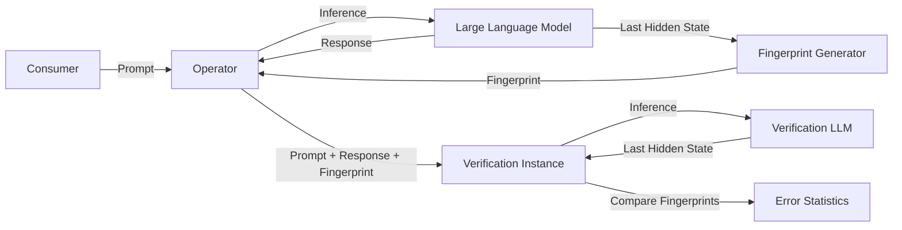

# System Architecture

The following diagram illustrates the flow of data through our system:

```mermaid
graph LR
    Consumer[Consumer] -->|Prompt| Operator[Operator]
    Operator -->|Inference| LLM[Large Language Model]
    LLM -->|Last Hidden State| FingerprintGen[Fingerprint Generator]
    FingerprintGen -->|Fingerprint| Operator
    LLM -->|Response| Operator
    Operator -->|Prompt + Response + Fingerprint| Verification[Verification Instance]
    Verification -->|Inference| VerificationLLM[Verification LLM]
    VerificationLLM -->|Last Hidden State| Verification
    Verification -->|Compare Fingerprints| ErrorStats[Error Statistics]
```
